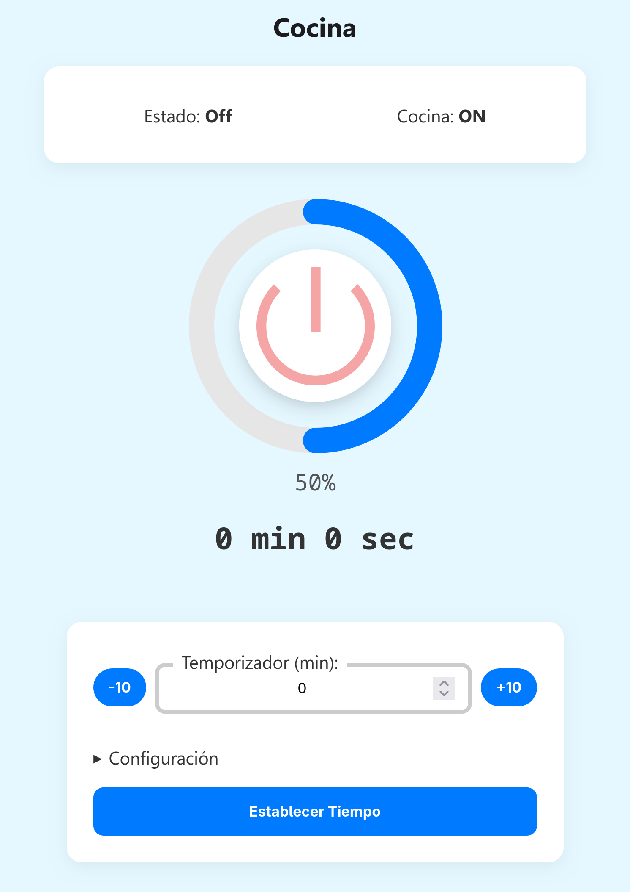

<div align="center">
<h3>ESP01S controlled for a Resistive Element (Kitchen)</h3>

</div>

---



## Goal

Controlling a resistive AC heating element using an SSR (Solid State Relay) controlled by a ESP01 (or ESP01S, ESP8266 based board), using the ESP8266 RTOS SDK.

* Push-button On/Off :heavy_check_mark:
* App Control (On/Off, Timer, Dimmer) :heavy_check_mark:
* OTA Update :x:
* Translations :x:
* CI/CD (Github Actions) :heavy_check_mark:

## Build

> [!NOTE]
> The main difference between the ESP01 and the ESP01S is the flash memory size, the Espressif SDK allows a minimum of 1MB so it verifies that the compiled file fits in the flash memory (~450kB ~330Kb compressed).

* Install the [ESP8266 RTOS SDK](https://github.com/espressif/ESP8266_RTOS_SDK) and configure it.
* Clone this repo

```bash
git clone https://github.com/jackestar/ESP01S-Kitchen.git --depth 2
```

* set the environment `export IDF_PATH=[your ESP8266 SDK path]` and `. $IDF_PATH/export.sh`

* make and flash

```
make flash
```

## Board and Schematics

[Articulo del Esquemático](https://jackestar.netlify.app/Blog/Kicad/ESP01S-Kitchen-Driver.html)


[Kicad Project](Kicad)

# License

**This Repo** - MIT License

**ESP8266 RTOS SDK** - Apache 2.0

**Material Symbols / Material Icons** - Apache 2.0